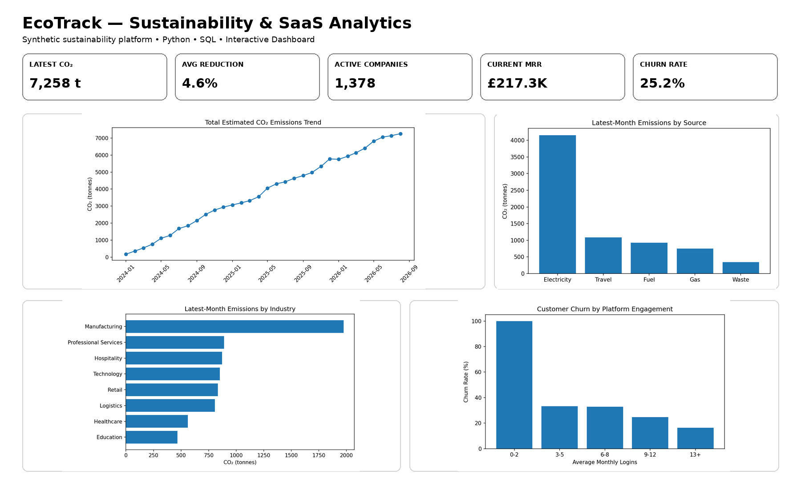

# EcoTrack — Sustainability & SaaS Analytics

EcoTrack is an end-to-end **Data Analyst portfolio project** combining sustainability analytics with SaaS/product analytics.

> **Important:** All companies, activity data and emissions conversion factors are synthetic. The emissions estimates are illustrative and are **not** suitable for official carbon accounting or regulatory reporting.

## Live Dashboard

Explore the interactive EcoTrack dashboard:

**[Open Live Dashboard](https://hackpavan.github.io/ecotrack-sustainability-analytics/)**

## Business problem

EcoTrack is a fictional platform that helps businesses monitor resource use, estimated emissions and sustainability progress while paying a recurring subscription.

The analysis asks:

- Which activities contribute most to estimated CO₂ emissions?
- Which industries have the highest total and per-employee emissions?
- Are customers reducing emissions relative to their baseline?
- What are MRR, ARR and churn?
- Do customers who actively use the platform churn less?
- Which accounts may require customer-success attention?

## Tech stack

Python • Pandas • NumPy • SQL • Matplotlib • Jupyter • JavaScript dashboard • Pytest • GitHub Actions

## KPI snapshot

| KPI | Result |
|---|---:|
| Latest estimated CO₂ | 7,258.4 tonnes |
| Average active-company reduction | 4.58% |
| Active companies | 1,378 |
| Current MRR | £217,332.00 |
| Current ARR | £2,607,984.00 |
| Overall churn | 25.17% |

## Dashboard



## Key findings

- **Electricity** is the largest estimated emissions source in the latest synthetic month.
- **Manufacturing** has the highest total latest-month emissions at approximately **1,974 tonnes**.
- Active companies show an average estimated reduction of about **4.6%** from their first observed month.
- Platform engagement is analysed against churn to identify whether low-usage accounts may require onboarding or customer-success support.

These are findings from a synthetic model, not real-world environmental claims.

## Data model

### Company-level table
`data/processed/companies_clean.csv`

One row per company, including subscription details, engagement summaries, reduction performance and churn.

### Monthly activity table
`data/processed/monthly_sustainability_clean.csv`

One row per active company per month, including resource use, estimated CO₂, platform engagement and MRR.

## SQL skills demonstrated

- CTEs
- joins
- `LAG()`
- `DENSE_RANK()`
- window functions
- `CASE WHEN`
- emissions-intensity calculations
- customer risk segmentation
- recurring revenue analysis
- cohort retention

## Repository structure

```text
ecotrack-sustainability-analytics/
├── data/
│   ├── raw/
│   └── processed/
├── notebooks/
│   └── 01_ecotrack_analysis.ipynb
├── sql/
│   ├── schema.sql
│   └── analysis_queries.sql
├── dashboard/
│   └── index.html
├── images/
│   └── ecotrack_dashboard.png
├── src/
│   ├── clean_data.py
│   └── analysis.py
├── tests/
├── LEARN_ECOTRACK.md
├── index.html
└── README.md
```

## Interview explanation

> I built EcoTrack, a synthetic sustainability SaaS analytics project. I modelled business resource usage such as electricity, fuel, travel and waste and converted those activities into illustrative CO₂ estimates. I combined this with subscription and product-engagement data to analyse emissions trends, reduction performance, MRR, churn and retention. I used Python for data preparation, SQL for business analysis and an interactive dashboard to communicate the results.

## Run locally

```bash
pip install -r requirements.txt
python src/clean_data.py
python src/analysis.py
pytest -q
```

## Author

Pavan Shetty — Data Analyst portfolio project
